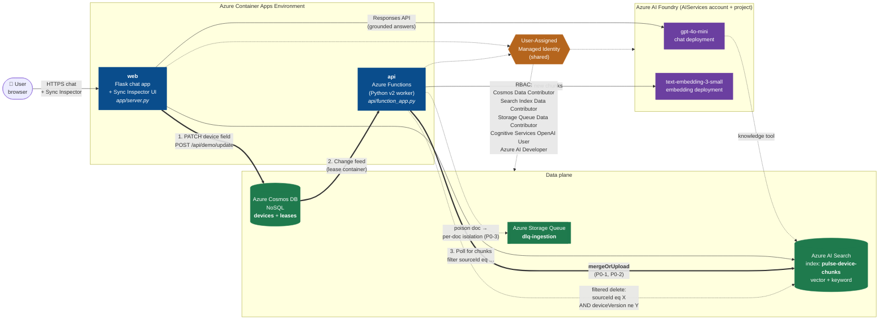
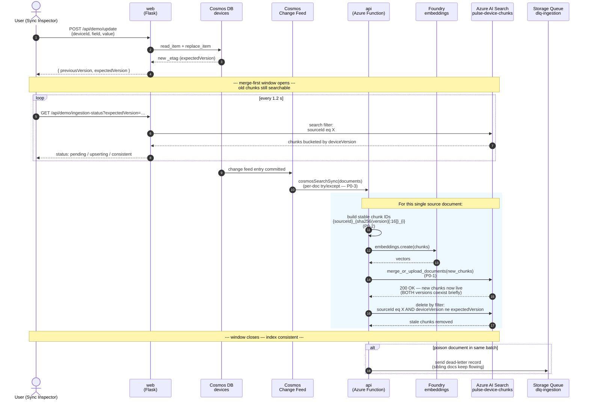

# Pulse RAG P0 sample with Cosmos DB incremental sync and Azure AI Search

This sample is a customer-demo reference architecture for a Retrieval Augmented Generation app where:

- **Azure Cosmos DB (NoSQL API)** is the system of record for device documents.
- **Azure Functions** subscribes to the Cosmos DB change feed and incrementally syncs each changed document into Azure AI Search using `mergeOrUpload`, never a delete-then-upload.
- **Azure AI Search** stores chunked, vectorized content with stable, content-versioned IDs so retries are safe and partial failures never blank the index.
- **Azure AI Foundry** (an AIServices account with a project) hosts both the chat and embedding model deployments. The Flask chat app calls the project endpoint via `AIProjectClient` and persists the conversation ID in the browser session so chat history survives refreshes.

The goal is to give a customer a small, readable codebase that proves you can run a production-grade RAG ingestion path without the three failure modes that most demos hide: stale-index blanking on partial failures, duplicate chunks from retries, and one bad document poisoning a whole batch.

The implementation is shaped around the P0 recommendations in [claude-recs.md](../claude-recs.md).

## Architecture



**How to read the arrows:**

- **Solid bold arrows (`==>`)** trace the merge-first write path: Sync Inspector writes to Cosmos, the change feed hands the document to the Function, the Function calls `mergeOrUpload` against Search. This is the P0-1 / P0-2 critical path.
- **Solid thin arrows (`-->`)** are the steady-state reads (chat grounding, Sync Inspector polling, embedding generation).
- **Dotted arrows (`-.->`)** are the safety nets: filtered cleanup of stale chunks _after_ a successful upsert, dead-letter routing for poison documents, and the managed-identity RBAC grants that authorize every plane.

There are no keys or connection strings in this architecture — the single user-assigned managed identity carries the auth on every data and model call.

### The merge-first window, step by step

This sequence diagram is the deep dive on the bold `==>` arrows above. It's also exactly what the **Sync Inspector** panel animates in the UI.



**Why each numbered step matters for the demo:**

| Step                  | What you say to the audience                                                                                                                                                                                  |
| --------------------- | ------------------------------------------------------------------------------------------------------------------------------------------------------------------------------------------------------------- |
| 1–4                   | "The write returns _immediately_ — we don't block on indexing. The new etag is the contract between the writer and the watcher."                                                                              |
| 5–8 (polling loop)    | "Every 1.2 seconds the UI asks Search a single filter query and classifies the chunks by `deviceVersion`. That's how the timeline transitions from **pending → upserting → consistent**."                     |
| 9–10                  | "Cosmos hands the change to the Function within a second or two — no polling indexer, no schedule."                                                                                                           |
| 11 (stable chunk IDs) | "**P0-2.** Same document version always produces the same chunk IDs. If the Function retries, Search sees the same keys and overwrites in place instead of duplicating."                                      |
| 13 (`mergeOrUpload`)  | "**P0-1.** This is the moment that prevents stale-index blanking. Old chunks are still answering queries. New chunks become live. There is _no_ window where the document is missing from Search."            |
| 15 (filtered delete)  | "Only _after_ the upsert succeeds do we delete the previous version's chunks — and only the ones that belong to this device. One query, scoped by `sourceId` _and_ `deviceVersion ne expectedVersion`."       |
| `alt` block           | "**P0-3.** If one document in the change-feed batch throws, the per-document try/except routes it to the DLQ and the rest of the batch keeps going. One bad device can't take down the indexer for the rest." |

## P0 behaviors

| P0 control                                     | What the code does                                                                                                                                                              | Where                                                                                |
| ---------------------------------------------- | ------------------------------------------------------------------------------------------------------------------------------------------------------------------------------- | ------------------------------------------------------------------------------------ |
| **P0-1: Merge-first indexing**                 | Replacement chunks are upserted with `mergeOrUpload`. Stale chunks are only deleted _after_ the upsert succeeds, so a mid-flight failure leaves the previous content available. | [`api/indexing.py`](api/indexing.py) — `SearchIngestionService.sync_source_document` |
| **P0-2: Idempotent chunk keys**                | Each chunk ID is `{sourceId}_{sha256(version)[:16]}_{chunkIndex}`, so retrying the same change overwrites the same documents instead of creating duplicates.                    | [`api/indexing.py`](api/indexing.py) — `build_chunk_id`                              |
| **P0-3: Per-document failure isolation + DLQ** | The change feed handler processes one source document at a time. A failure is logged and pushed to an Azure Storage Queue dead-letter queue; sibling documents keep flowing.    | [`api/ingest.py`](api/ingest.py) + [`api/dlq.py`](api/dlq.py)                        |

## What's in the box

| Path                                       | Purpose                                                                                                                          |
| ------------------------------------------ | -------------------------------------------------------------------------------------------------------------------------------- |
| `api/function_app.py`                      | Azure Functions entry point that registers HTTP and Cosmos-triggered blueprints                                                  |
| `api/ingest.py`                            | Cosmos DB change-feed trigger with per-document isolation and DLQ routing                                                        |
| `api/indexing.py`                          | Chunking, embeddings, stable IDs, merge-first upsert, post-success stale cleanup                                                 |
| `api/dlq.py`                               | Dead-letter queue helpers for failed source documents                                                                            |
| `api/query.py`                             | `/health`, `/p0/summary`, and `/search/preview` HTTP endpoints                                                                   |
| `api/shared_code/config.py`                | Settings and authenticated client factory                                                                                        |
| `app/server.py`                            | Flask chat app, session-persisted Foundry conversation ID                                                                        |
| `app/foundry_chat.py`                      | Foundry project client wrapper around the agent reference                                                                        |
| `app/templates/index.html`, `app/static/*` | Minimal browser chat UI                                                                                                          |
| `infra/`                                   | Bicep + `azure.yaml` to deploy Cosmos DB, AI Search, Storage, Function App, Foundry project, and the Flask app to Container Apps |
| `infra/index/pulse-device-chunks.json`     | Azure AI Search index schema (vector + keyword)                                                                                  |
| `scripts/seed_cosmos.py`                   | Seeds Cosmos DB with sample device documents to drive the change feed                                                            |
| `scripts/update_device.py`                 | Updates a single device so you can demo incremental, merge-first reindexing                                                      |
| `scripts/sample_devices.json`              | Sample IoT device dataset used by the seed and update scripts                                                                    |
| `tests/test_indexing.py`                   | Unit tests that pin the "delete only after successful upsert" invariant                                                          |

## End-to-end demo flow

1. **Provision** infra with `azd up` (see [Deployment](#deployment) below).
2. **Seed** Cosmos with `python scripts/seed_cosmos.py`. Watch the Function App log lines as the change feed triggers and each device is indexed with `mergeOrUpload`.
3. **Update** one device with `python scripts/update_device.py --id device-003 --status offline`. Show that _only that document's_ chunks are re-indexed and the stale chunks from the prior version are removed.
4. **Chat** at the deployed Container App URL (or `http://localhost:8000` locally). The Foundry agent answers questions grounded in the AI Search index, and the conversation ID is persisted across page refreshes.
5. **Inject a poison doc** to show the DLQ catches it without stalling the rest of the batch: `python scripts/update_device.py --id device-004 --poison`.

## Local development

### Function App

1. Copy `api/local.settings.json.rename` to `api/local.settings.json` and fill in Cosmos DB and Azure AI Search values.
2. `pip install -r api/requirements.txt`
3. Start with `func start` from the `api/` folder.

### Chat app

1. Copy `app/sample.env` to `app/.env` and fill in `PROJECT_ENDPOINT` and `AGENT_NAME`.
2. `pip install -r app/requirements.txt`
3. `python server.py` from the `app/` folder.

If Foundry settings are missing, the app still starts and `/api/chat` returns a clear configuration error instead of failing at import.

### Tests

```pwsh
python -m unittest discover -s pulse-rag-p0-sample/tests -p "test_*.py"
```

## Deployment

This sample uses the Azure Developer CLI. From the `pulse-rag-p0-sample/` folder:

```pwsh
azd auth login
azd up
```

`azd up` will:

1. Deploy Cosmos DB (with a `devices` container and a `leases` container for the change-feed processor), Azure AI Search (with the vector + keyword index in [`infra/index/pulse-device-chunks.json`](infra/index/pulse-device-chunks.json)), Azure Storage (for the Functions runtime and the DLQ), and an Azure AI Foundry account + project hosting `gpt-4o-mini` and `text-embedding-3-small` model deployments.
2. Deploy the Function App (container) to Azure Container Apps with managed-identity access to Cosmos, Search, Storage, and the Foundry account (used for both chat retrieval and embedding generation during ingestion).
3. Deploy the Flask chat app (container) to Azure Container Apps, wired to the same managed identity and the Foundry project endpoint.
4. Print the chat URL and a seed command you can run.

See [`infra/README.md`](infra/README.md) for what each resource does and how the RBAC role assignments line up with the code.

## P1 / next-step pointers

This sample intentionally implements only the P0 controls so it stays small and reviewable. The companion playbook in [claude-recs.md](../claude-recs.md) describes P1 follow-ups including Azure AI Search integrated vectorization, partial document updates, checkpoint freshness monitoring, and semantic caching.
